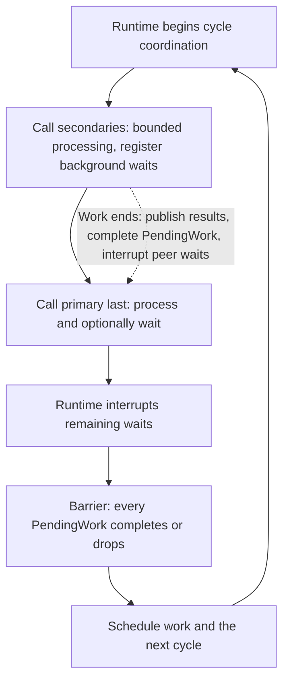
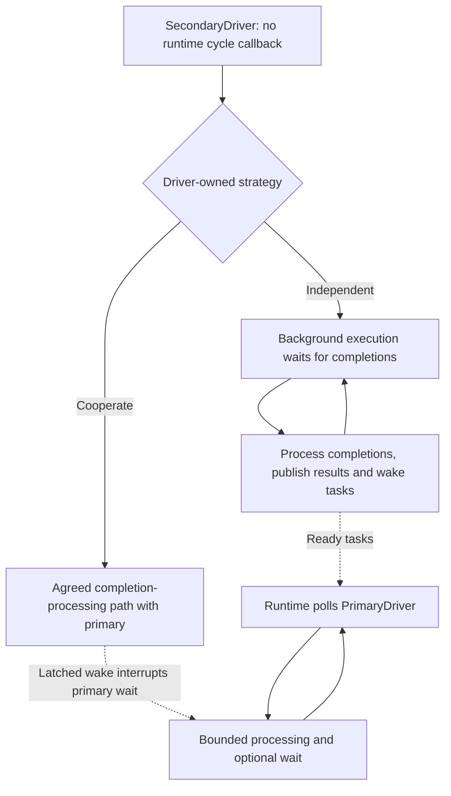

# I/O driver coordination: sync brief

**Preliminary findings, 2026-10-06.** The coordinated experiment delivered higher
throughput, including +28.9% with disjoint VM-exposed core masks, but all three
extended batches failed the repeatability gate. Excess satellite kernel calls
are **not** supported as the explanation. Discuss the coordination contract now;
do not treat these numbers as a production performance guarantee.

## The two approaches

This compares the [older `PendingWork` contract][old] with the
[role-specific contract][current] developed in [PR #737][pr737].
These links pin the evaluated API snapshots.

| Concern | Runtime-coordinated `PendingWork` | Role-specific drivers |
| --- | --- | --- |
| Lifecycle | `Driver` supplies cycle processing and shutdown. | `Driver` is the shared lifecycle base. |
| Roles | Runtime assigns primary/secondary roles. | Provider returns a permitted `DriverInstance::Primary` or `Secondary`. |
| Runtime loop | Calls secondaries, then primary. | Calls only `PrimaryDriver`, which owns `execute_cycle` and `waker()`. |
| Secondary progress | Non-blocking turn; may start background waits. | Cooperates with primary or processes completions independently. |
| Coordination | Runtime interrupts waits and joins their barrier. | No secondary cycle callback or runtime-managed barrier. |
| Main trade-off | Explicit boundaries, but interruption and barrier costs. | Simpler runtime; drivers own progress and coordination. |

### Older: coordinated cycles

`Cycle::start_work` registers a wait and its interruption waker before execution.
The returned `PendingWork` stays alive until that work ends. Publishing results
then completing/dropping the handle interrupts peer waits and releases one barrier
participant. It does **not** represent every in-flight I/O or guarantee one syscall.

### Latest: role-specific execution

The primary processes bounded batches and may wait up to `Cycle::max_wait`.
Its waker must remain observable across wait-entry races. Secondaries have no
runtime callback: waking the primary alone does not process their completions.
Cooperation needs an actual shared processing path; core provides no peer-discovery
mechanism. Both approaches require safe dropping and independently progressing,
bounded shutdown attempts.

## Does continuous processing mean excessive kernel calls?

The existing satellite in [ox-sdk PR 5620227][ox-pr] uses an indefinite
**blocking wait**, not a zero-timeout busy loop. It sleeps while idle, but a
completion can end the wait and cause another native call.

| Mechanism | Consequence |
| --- | --- |
| Blocking/event-driven waits | Avoid empty spinning; separately arriving completions can still cause separate dequeue calls. |
| Batching | Retrieves already queued completions; an independent consumer may drain before a larger batch accumulates. |
| Wakeups | Task wakes, real completions and synthetic interruption packets are different sources of work. |
| Readiness polling | Repeated empty zero-timeout native calls can spin. Userspace `io_uring` queue checks need not be syscalls. |

Independent execution can incur cross-thread scheduling and cache costs, and
needs explicit shutdown interruption. These are potential trade-offs, not proven
causes of the reported regression. `PendingWork` can also wake on individual
completions and adds cycle-level interruption/rearming; neither contract promises
fewer kernel calls.

## Preliminary measurements

The experiment used ox-sdk `load_testing`: **unchanged satellite (A)** versus a
**private `PendingWork`-style coordination adapter (B)**. Both retain the same
native IOCP driver on a satellite thread and the same parked primary. This tests
coordination, **not thread removal, inline placement or the full historical API**.

Setup: Windows VM, Xeon Platinum 8370C, 16 logical processors, release binaries,
local Axum server, HTTP/1.1 hello-world, two client workers and 64 concurrent
requests per worker. Each batch used 12 pairs with balanced A/B and B/A order,
15-second warmup per run, and no measured-run exclusions. Batches are analyzed
separately, never pooled.

| Duration / placement | Satellite mean | Coordinated mean | Paired advantage | Nominal 95% B/A interval |
| --- | ---: | ---: | ---: | --- |
| 60 s / overlapping | 18,598 requests/s | 23,398 requests/s | +26.0% | 1.216 to 1.306 |
| 120 s / overlapping | 19,138 requests/s | 25,060 requests/s | +30.9% | 1.241 to 1.381 |
| 60 s / disjoint masks | 22,339 requests/s | 28,839 requests/s | +28.9% | 1.211 to 1.372 |

All 72 measured runs succeeded with zero reported failures; B was faster in every pair.
Advantages use paired geometric throughput ratios, not ratios of the table's
arithmetic means. Intervals are Student-t intervals on paired log ratios; they
do not account for systematic host interference.

**The magnitude is not stable.** All batches failed the predeclared gate:
interval relative half-width at most 3%, and order/half-batch discrepancies at
most 5%. The overlapping batches had interval half-widths of 3.58% and 5.35%;
the second had 13.07% temporal drift. Earlier short pilot runs even reversed
the aggregate.

The topology probe found that server mask `0x1` and client mask `0xE` share
SMT siblings of one VM-exposed core. The third batch changed only the client
mask to `0x1C`, preserving processor counts, binaries and workload. Process masks
and exposed-core topology were verified, **not thread-level placement or host
isolation**. One placement-probe failure before a valid timed row is preserved.

With disjoint masks, order and half-batch discrepancies passed (2.92% and 1.36%),
but interval half-width was 6.24%; maximum deviations from each variant's median
were 13.7% for A and 27.2% for B. Mean client CPU time per request was
97.9 versus 68.9 microseconds; mean per-run p99 latency was 8.602 versus 6.719 ms
(not pooled percentiles). Mean server CPU was 78.0% versus 70.1% of its one
affined logical processor, observed across each client run including warmup.
The direction persisted, but removing the overlap did not eliminate variation.

### Native-call evidence

A separate diagnostic pair with the original overlapping placement found:

| Whole-process IOCP metric | Satellite | Coordinated |
| --- | ---: | ---: |
| Dequeue API observations | 595,101 | 2,084,960 |
| Real completions, excluding synthetic wakes | 596,551 | 793,813 |
| Native wake posts after deduplication | 2 | 1,964,195 |
| Dequeue calls per real completion | 0.998 | 2.627 |

The coordinated adapter made **about 2.63 times more dequeue calls per real
completion**, with many synthetic interruption wakes. Its apparent throughput
advantage therefore cannot be explained by fewer dequeue calls.

These count `GetQueuedCompletionStatusEx` returns with success or timeout,
not every process syscall. Native counters include warmup/shutdown, unlike
measured HTTP throughput: do not divide them by measured-phase request totals.
No native counters were collected in the extended throughput batches, including
the disjoint-mask series; these counts must not be presented as its measurements.

## Decisions for the sync

1. **Contract:** should the runtime guarantee a per-cycle secondary completion
   barrier, or should driver authors own progress and coordination entirely?
2. **Trade-off:** is the additional runtime protocol justified by a reproducible
   throughput/latency benefit, despite its interruption overhead?
3. **Evidence gate:** keep production defaults unchanged. The disjoint-mask
   series still failed the precision target; use a controlled host and verified
   thread placement before further repetition, then confirm representative
   workloads. Track throughput, tail latency, CPU per request, native calls
   per real completion and wake posts, rather than syscall count alone.

Evidence is preserved privately: ox-sdk base commit
`c217ab69d2830bb823fee41366c555e0e153ac10` plus the experimental patch;
`pending-work-experiment-bundle`, `pending-work-extended-batch`,
`pending-work-extended-batch-2` and `pending-work-disjoint-affinity-batch` contain
replay scripts, fixed protocols, binary hashes and all raw results.
Private source and logs are not included here.
The measurements cover this local IOCP client workload, not RIO or `io_uring`,
and do not establish the cause of the original PR's performance concern.

[pr737]: https://github.com/microsoft/oxidizer/pull/737
[old]: https://github.com/microsoft/oxidizer/blob/bc7866c2fb081387bf92dcd7ead17463f30aa5f1/crates/arty_io_core/docs/REQUIREMENTS.md
[current]: https://github.com/microsoft/oxidizer/blob/25e1681d9a2017b7c774196f53736b8538ae0488/crates/arty_io_core/src/driver.rs
[ox-pr]: https://o365exchange.visualstudio.com/O365%20Core/_git/ox-sdk/pullrequest/5620227
