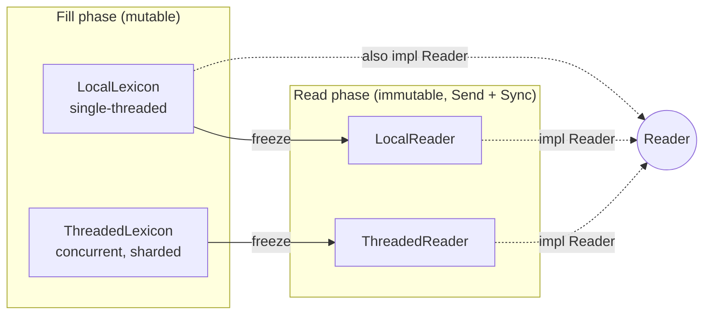
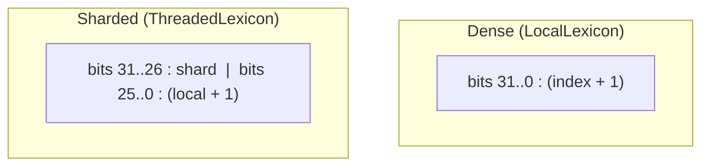
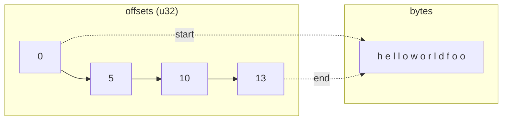
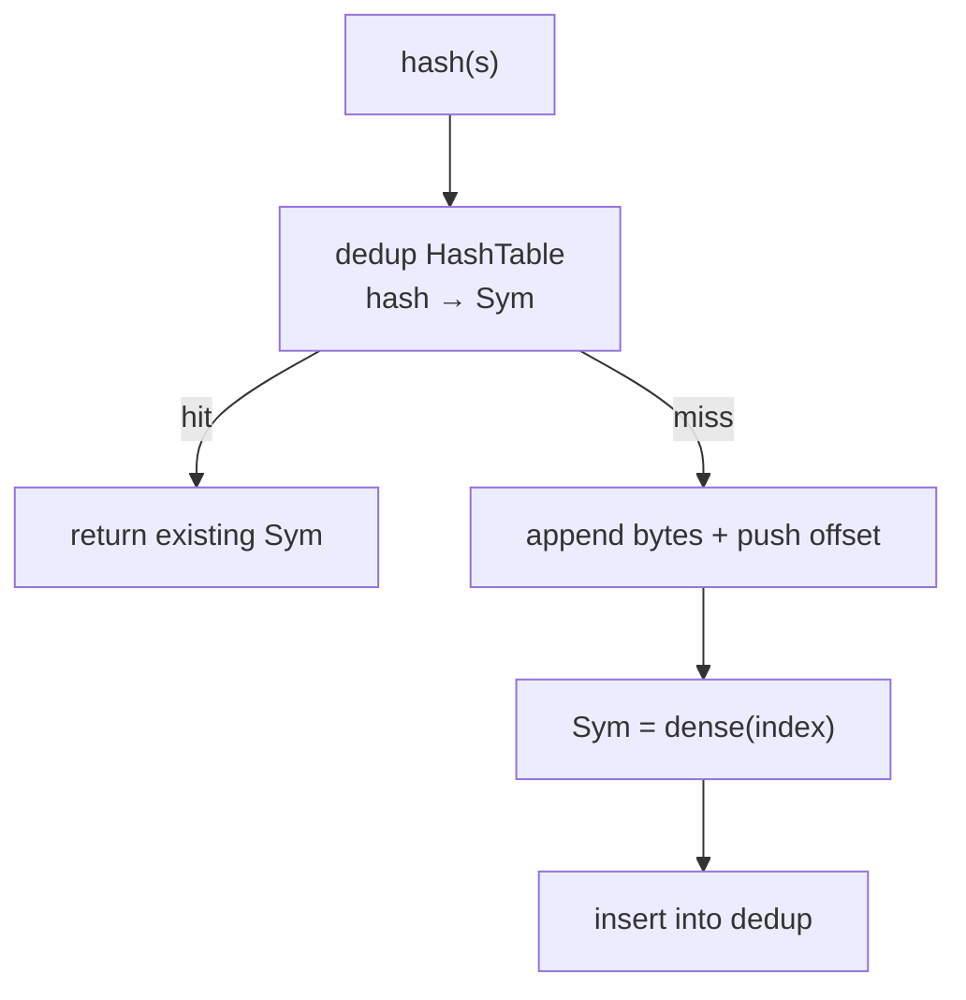
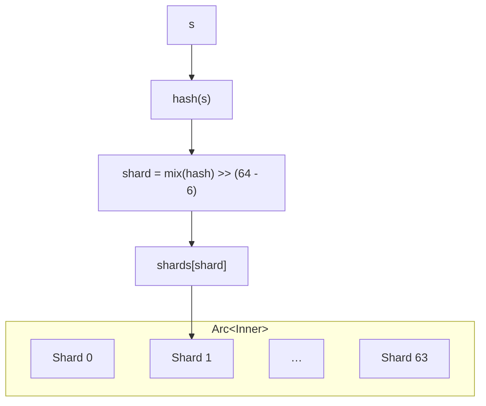
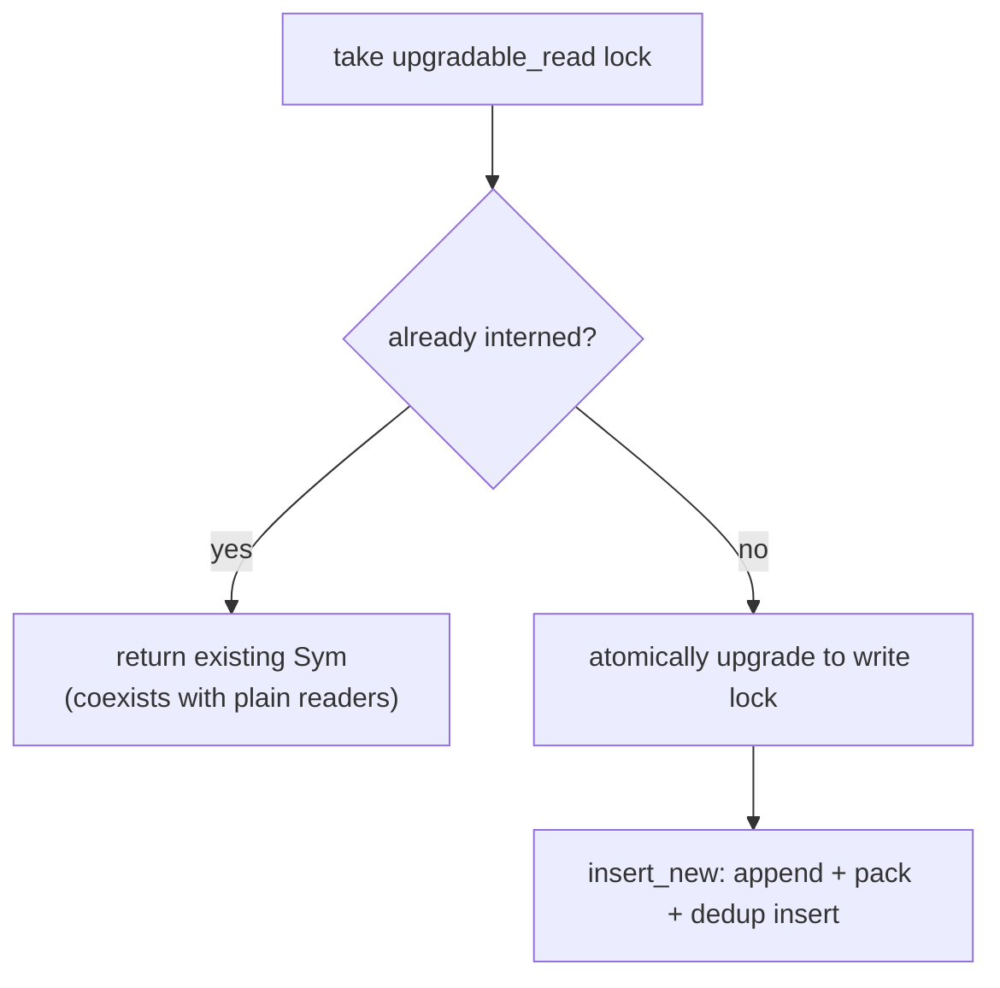
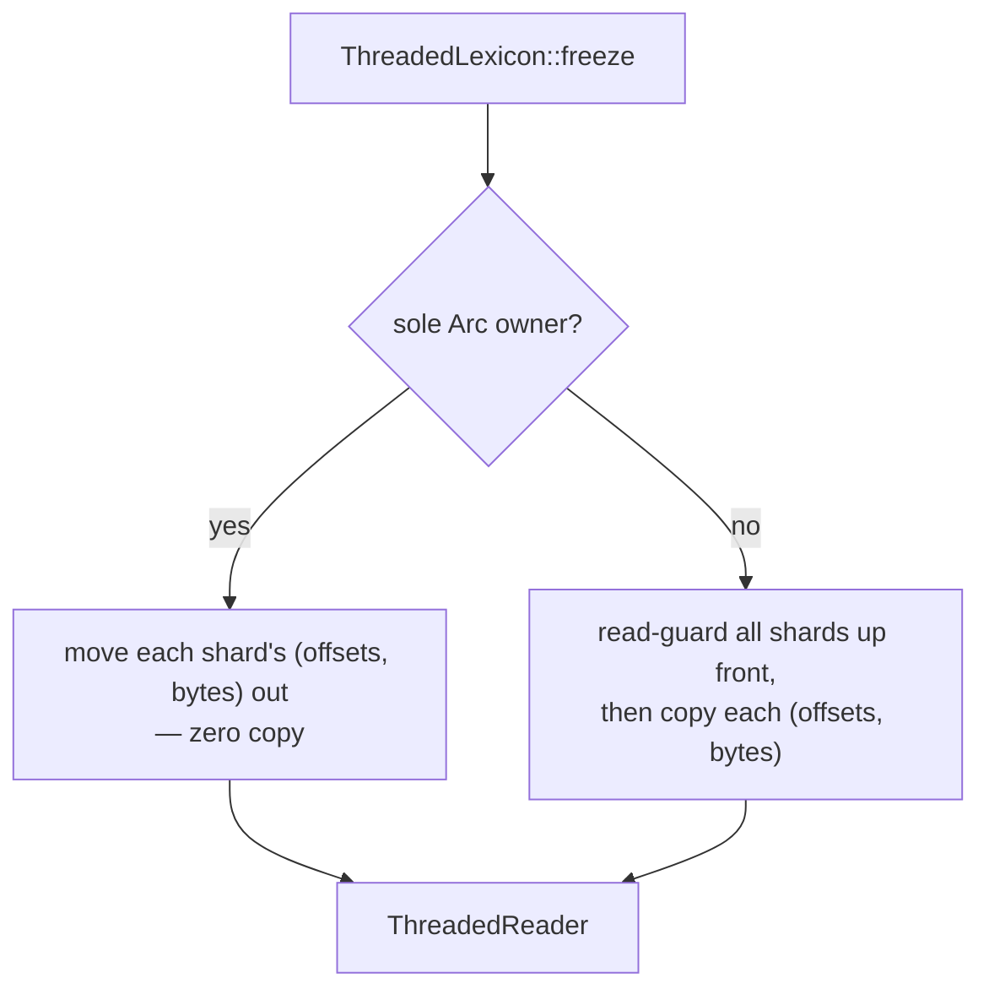

# internity Internal Design

This document describes the internal architecture of `internity`: the data model,
how strings are stored, how handles are encoded, and how the pieces fit together.
It is a conceptual reference for contributors — for the public API and usage, see
the crate docs and `README.md`.

## Mental model

`internity` is built around a **fill → freeze → read** lifecycle. The two phases
have very different needs, and the design keeps them separate:

- **Fill (interning).** A *lexicon* accepts strings, removes duplicates, and hands
  back a compact handle. This phase mutates state and, for the concurrent engine,
  synchronizes writers. Repeated interning of the same string is collapsed to one
  stored copy.
- **Freeze.** The lexicon is consumed and turned into an immutable *reader*.
  Existing handles stay valid across the boundary.
- **Read (resolving).** A reader maps handles back to strings. It is immutable,
  `Send + Sync`, lock-free, and atomic-free.

Both engines are exposed through a common `Lexicon` trait for generic/dynamic
use, and both freeze into something that implements the sealed `Reader` trait.

## The `Sym` handle

Interning yields a `Sym`: a 4-byte, `Copy` handle. Internally it is a
`NonZeroU32`, which gives two properties for free:

- **Niche optimization.** `Option<Sym>` is also 4 bytes.
- **A reserved zero.** The value `0` is never a valid handle. This satisfies the
  `NonZeroU32` niche and lets the crate reject a *zero* raw value cheaply; it is
  **not** a provenance check — a nonzero handle minted by another interner is not
  detected by the reserved zero.

A `Sym` is only meaningful to the interner that produced it. Each engine packs
its own layout into the 32 bits and only decodes its own handles. There are two
distinct encodings:

| Engine | Encoding | Layout |
|---|---|---|
| `LocalLexicon` | **Dense** | A 1-based insertion index across the whole table. |
| `ThreadedLexicon` | **Sharded** | High bits select the shard, low bits are a 1-based per-shard index. |

Storing indices **1-based** guarantees the raw value is non-zero (satisfying the
`NonZeroU32` niche). Decoding subtracts one to recover the physical index.
Because the two encodings are different, a handle produced by one engine
resolved on the other is caught by range checks — it can never cause undefined
behavior, though an in-range foreign value may resolve to an unrelated string.

The shard/local split is fixed at 6 shard bits and 26 local bits, giving 64
shards and up to approximately 67 million distinct strings per shard.

## String storage: the CSR model

Every place strings are stored — both lexicons and every frozen reader — uses the
same **Compressed-Sparse-Row (CSR)** layout:

- **`bytes`** — a single contiguous buffer holding every interned string's bytes,
  concatenated end to end.
- **`offsets`** — a `u32` table of boundaries. `offsets[i]` is the start and
  `offsets[i + 1]` the end of the *i*-th string. A leading `0` sentinel means the
  table always holds `len() + 1` entries.

Resolving string *i* is then just: read two adjacent `offsets` slots and slice
`bytes` between them — no per-index branch, and the length is implicit in the
neighboring offset.

Because every recorded range was produced by appending an actual `&str`, the
spanned bytes are **always valid UTF-8**. This is exploited to skip UTF-8
re-validation on the hot path. All such unchecked reconstruction lives in a
single small storage module — the crate's *only* deliberate `unsafe` — with two
entry points:

- A **hot-path** helper for an index the dedup table just produced (assumed
  in range).
- A **checked** resolve for public paths that must tolerate foreign or stale
  handles, returning `None` when out of range.

Every other module forbids `unsafe`.

### Byte-input interning (`intern_bytes`)

The "stored bytes are always valid UTF-8" invariant is also exploited on the
*input* side. Both engines expose `intern_bytes(&[u8]) -> Result<Sym, Utf8Error>`
alongside `intern(&str)`. Because callers frequently hold raw bytes straight from
a parser or an I/O buffer, `intern_bytes` accepts them directly and validates
UTF-8 itself — but **only on a dedup miss**. On a hit, the probe compares the
input against a stored entry *byte-for-byte*; a match proves the input equals an
already-interned string, which was validated when it was first inserted, so the
`str::from_utf8` check is skipped entirely.

This amortizes UTF-8 validation across duplicate inserts: in the
high-duplication workloads interning targets, each distinct *valid* byte
sequence is validated once (on its first insert) rather than on every
occurrence. Invalid bytes are never stored, so a repeated invalid input stays a
miss and re-validates each time. The output side is unchanged — handles still
resolve to a checked `&str`. In the sharded engine the check runs while the
upgradable read lock is still held, mirroring the `intern` miss path, so the
miss atomically upgrades to insert with no re-probe.

## `LocalLexicon` — the flat single-threaded engine

`LocalLexicon` is the fastest engine and the simplest. It holds:

- A **dedup hash table** mapping a string's hash to its `Sym`.
- The shared **CSR storage** (`offsets` + a `String` buffer).
- A `BuildHasher` (default is a fast, non-cryptographic Fx hasher).

Interning does a single hash-table probe. On a **hit** (the common steady-state
case) it returns the existing handle immediately. Only a genuine **miss** pays a
second probe to insert: the string's bytes are appended to the buffer, the new
end boundary is pushed onto `offsets`, a dense `Sym` is packed, and the handle is
inserted into the dedup table.

The dedup table stores only handles, not strings; comparisons and rehashes
resolve the candidate handle back through the CSR storage. This keeps the table
compact.

**Panic safety.** Growing the hash table or appending to the buffer can panic
(e.g. on allocation failure). A rollback guard truncates `offsets` and `bytes`
back to their pre-insert lengths if anything between the append and the
successful table insertion unwinds, so a partially written string never leaks
into the table.

`LocalLexicon` also implements `Reader` directly, so it can resolve during the
fill phase without freezing (handy when interning and lookups interleave). It
still offers `freeze` to shed the dedup table and hasher for the read phase.

## `ThreadedLexicon` — the concurrent sharded engine

`ThreadedLexicon` allows many threads to intern concurrently. It is a cheap,
cloneable `Arc` handle around shared inner state; cloning just bumps the `Arc`,
so clones can be handed to threads without extra wrapping.

The inner state holds a fixed **inline array of 64 shards** plus the hasher.
Because the `Arc` already heap-allocates the whole struct, the shard array lives
inline — reaching a shard is a single index into the `Arc` payload, no extra
indirection.

### Shard selection

The shard index comes from a **multiply-mix** of the hash (a golden-ratio
constant), taking the top 6 bits. Mixing keeps the shard selector independent of
the lower hash bits that `hashbrown` consumes internally for its control byte and
bucket index, keeping both well distributed.

### Per-shard concurrency

Each shard is its own interning state (a dedup table + CSR storage, identical in
shape to `LocalLexicon`'s) behind a `RwLock`. Shards are cache-line aligned to
avoid false sharing between neighboring locks.

Interning uses an **upgradable-read fast path**:

- A dedup **hit** resolves under an upgradable-read lock. That guard coexists
  with other threads' plain `read()` locks (used by `get`), but `parking_lot`
  permits only **one** upgradable guard per lock at a time, so two `intern`
  calls on the *same* shard serialize against each other even when both are
  dedup hits.
- A **miss** atomically upgrades that same guard to the exclusive write lock.
  Because the guard was held throughout, no other writer could have inserted the
  same string in between, so two threads racing on a new string can never mint
  two handles, and the insert skips re-probing.

`intern` calls on *different* shards proceed fully independently; same-shard
`intern` calls (hit or miss) serialize. Sharding therefore parallelizes
interning across shards, not within a single shard. Each shard uses the same
rollback-guard panic-safety scheme as the local engine. Since the engine is
fill-then-freeze, the per-shard
buffer may reallocate freely during the fill phase — no references into it are
outstanding until freeze.

## Freezing

`freeze` consumes an engine and produces an immutable reader. The key property is
that the CSR blobs are handed over as-is, so **no strings are re-walked or
re-validated**, and existing handles keep working.

- **`LocalLexicon::freeze`** moves its `offsets` and buffer into a **`LocalReader`**
  — one dense-indexed CSR blob, no shards, no atomics.
- **`ThreadedLexicon::freeze`** produces a **`ThreadedReader`** — one flat
  per-shard CSR blob, addressed by the handle's `[shard | local]` split.

The concurrent freeze has two paths depending on whether the caller holds the
last `Arc`:

The snapshot path acquires read guards on **all** shards up front, before any
blob is copied. While every guard is held no concurrent `intern` can commit (a
miss cannot upgrade to the write lock while a reader is present), so the copied
state is a single **point-in-time snapshot** even when other clones are still
interning. Guards are taken in shard-index order and `intern` only ever locks
one shard, so this cannot deadlock. Insertions that commit after the guards are
released are naturally not reflected — quiesce all writers before freezing when
the reader must contain every such insertion.

## The `Reader` trait

`Reader` is the read-only, `Send + Sync` view. It is **sealed** (it extends a
private supertrait), so it cannot be implemented downstream — which lets the
crate add methods without a breaking change. Its core operations are
`try_resolve` / `resolve`, `len`, `is_empty`, and `iter` (yielding
`(Sym, &str)` pairs).

Resolution is a pure CSR lookup with a range check, so it needs no locks or
atomics. `LocalReader` resolves a dense index directly; `ThreadedReader` first
indexes the shard (always in range, since the shard bits can't exceed the shard
count) then does a checked local lookup within that shard. Iteration order is
handle order for the flat reader and shard-grouped for the sharded reader.

## `Sym`-keyed maps: `SymMap` / `SymSet`

A `Sym` is already a unique small integer, so hashing it with a general-purpose
hasher is wasted work. `SymHasher` turns the handle straight into a
well-distributed 64-bit hash with a **single multiply** (the same golden-ratio
constant), giving near-perfect, collision-free behavior. `SymBuildHasher` is the
`BuildHasher`, and `SymMap` / `SymSet` are ready-made aliases (with the `std`
feature); in `no_std`, pair `SymBuildHasher` with any hash map.

The hasher accumulates rather than overwrites, so composite keys mix correctly,
while still collapsing to a plain multiply for the single-`u32` `Sym` case.

## Serialization (`serde` feature)

Serialization is **string-based and interner-aware**, so serialized data is
portable across processes and never leaks a lexicon-local handle onto the wire:

- A **`Sym`** has no plain `Serialize`/`Deserialize`. A bare `u32` handle is
  meaningless without the interner that produced it (and comparing handles across
  lexicons is unsound), so instead a `Sym` is (de)serialized *against* a reader or
  interner: it serializes to **its string** and deserializes **from a string**
  back into a freshly interned `Sym`.
- `#[derive(SerializeIn)]` / `#[derive(DeserializeIn)]` extend that model to
  aggregates. `SerializeIn<R: Reader + ?Sized>` resolves every embedded `Sym`
  against a `Reader` (`SerializeInWith::new(value, reader)` adapts a value into a
  plain `serde::Serialize`); `DeserializeIn<'de, I: Lexicon + ?Sized>` re-interns
  every string into the target interner (`interner.deserialize_in(deserializer)`).
  Both sides are `?Sized`, so erased contexts work symmetrically — a `&dyn Reader`
  on the serialize side and a `&mut dyn Lexicon` on the deserialize side.
- Impls cover `Sym`, scalars/`String`, `Option`, `Box`, `Vec`, `BTreeMap`,
  `BTreeSet`, tuples (arities 1–16, matching Serde), and — under `std` — `HashMap`
  / `HashSet` (including the
  `SymMap` / `SymSet` aliases). `#[internity(via_serde)]` opts a field out to its
  ordinary `serde` impl. `serde`'s `skip_serializing_if` is rejected at
  compile time by `SerializeIn` (a runtime skip predicate would diverge from the
  type's ordinary wire schema); use `skip_serializing` to always omit a field.
- A whole corpus serializes via **`SerializeReader`**: freeze a lexicon into a
  `Reader`, then wrap it — it emits the **sequence of interned strings** in handle
  order. The live `ThreadedLexicon` is **deserialize-only** (re-interning a string
  sequence into a fresh engine); serialize its frozen `Reader` instead, which
  takes a single point-in-time snapshot rather than tearing across shards under a
  concurrent writer.

## Capacity and limits

- The `u32` offset table caps a single flat buffer (`LocalLexicon`, or one shard)
  at approximately 4 GB of string bytes; a `ThreadedLexicon` spreads across 64
  shards for approximately 256 GB total.
- The 4-byte handle bounds the number of distinct strings: approximately 4.29
  billion for the dense encoding, approximately 67 million per shard for the
  sharded one.
- Exceeding any limit **panics** rather than corrupting data. Applications
  interning untrusted input should enforce count/byte quotas up front and supply
  a DoS-resistant `BuildHasher`.

## Module map

A quick orientation to how the concepts map onto the source layout:

| Area | Concept |
|---|---|
| Handle | `Sym` encoding (dense + sharded), niche, packing/decoding |
| Storage | CSR helpers; the crate's single `unsafe` module |
| Local engine | `LocalLexicon` + its `LocalReader` |
| Concurrent engine | `ThreadedLexicon`, its inner state, `Shard`, `ShardWrite`, and `ShardReader` / `ThreadedReader` |
| Traits | `Lexicon` (fill, generic/dyn) and `Reader` (read, sealed) |
| Maps | `SymHasher` / `SymBuildHasher` and the `SymMap` / `SymSet` aliases |
| Serde | string-based, interner-aware (de)serialization (`SerializeIn` / `DeserializeIn` / `SerializeReader`) |
