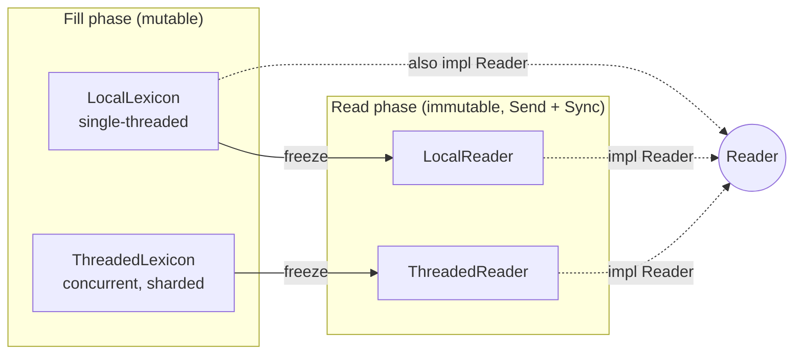
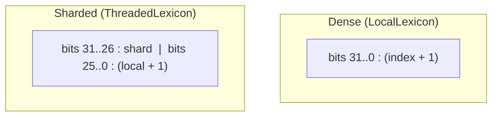
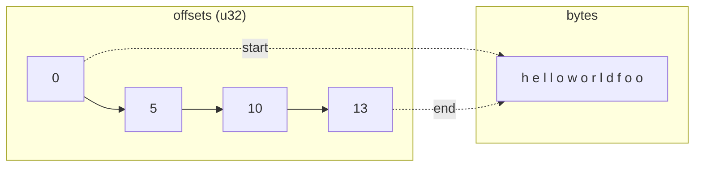
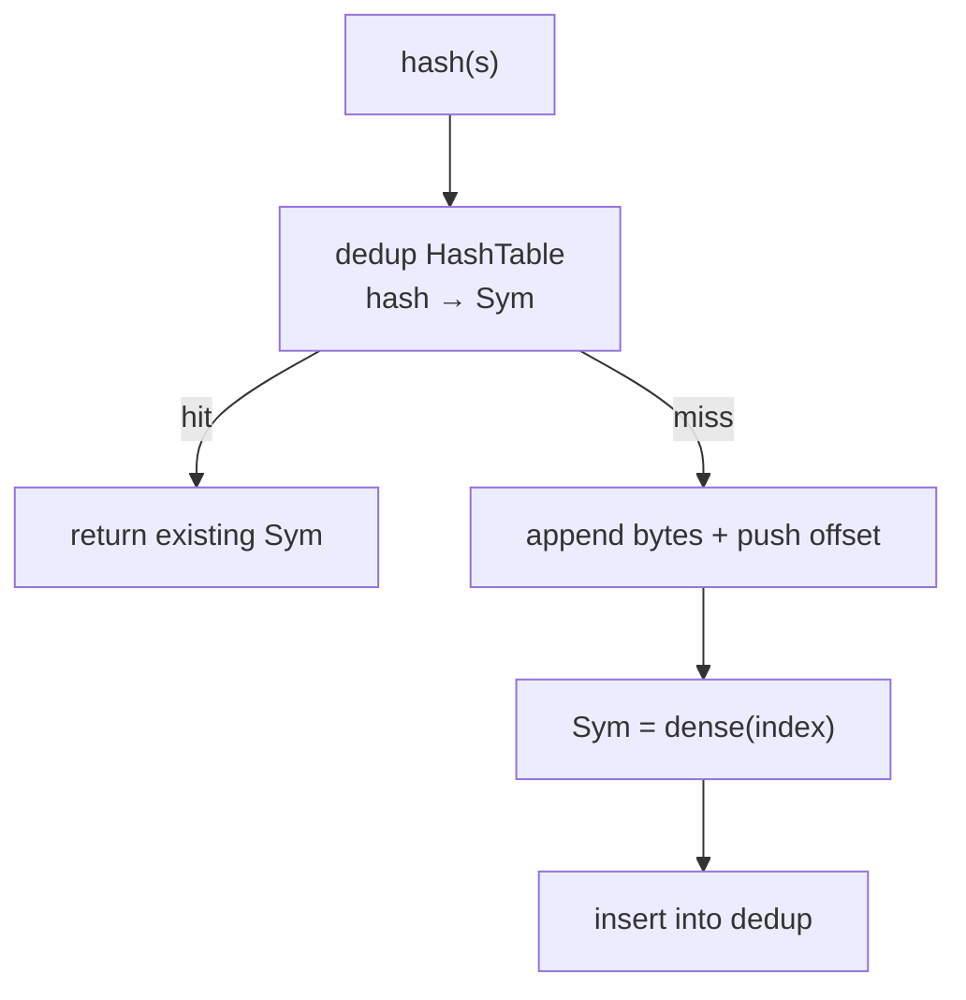
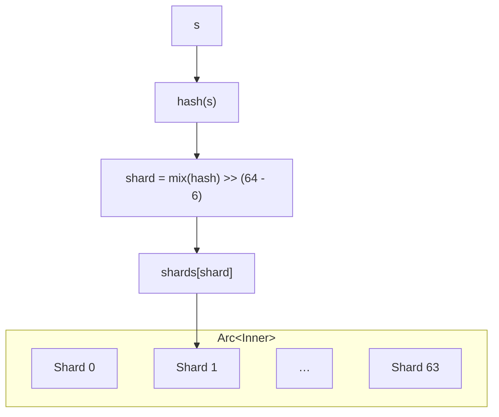
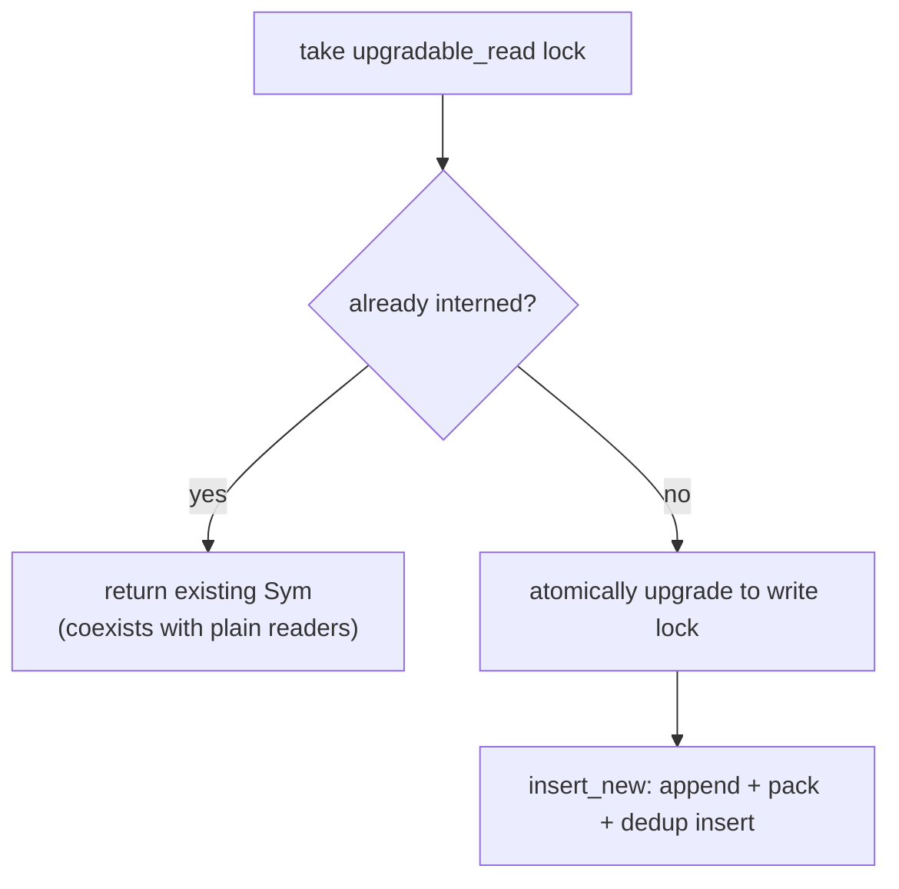
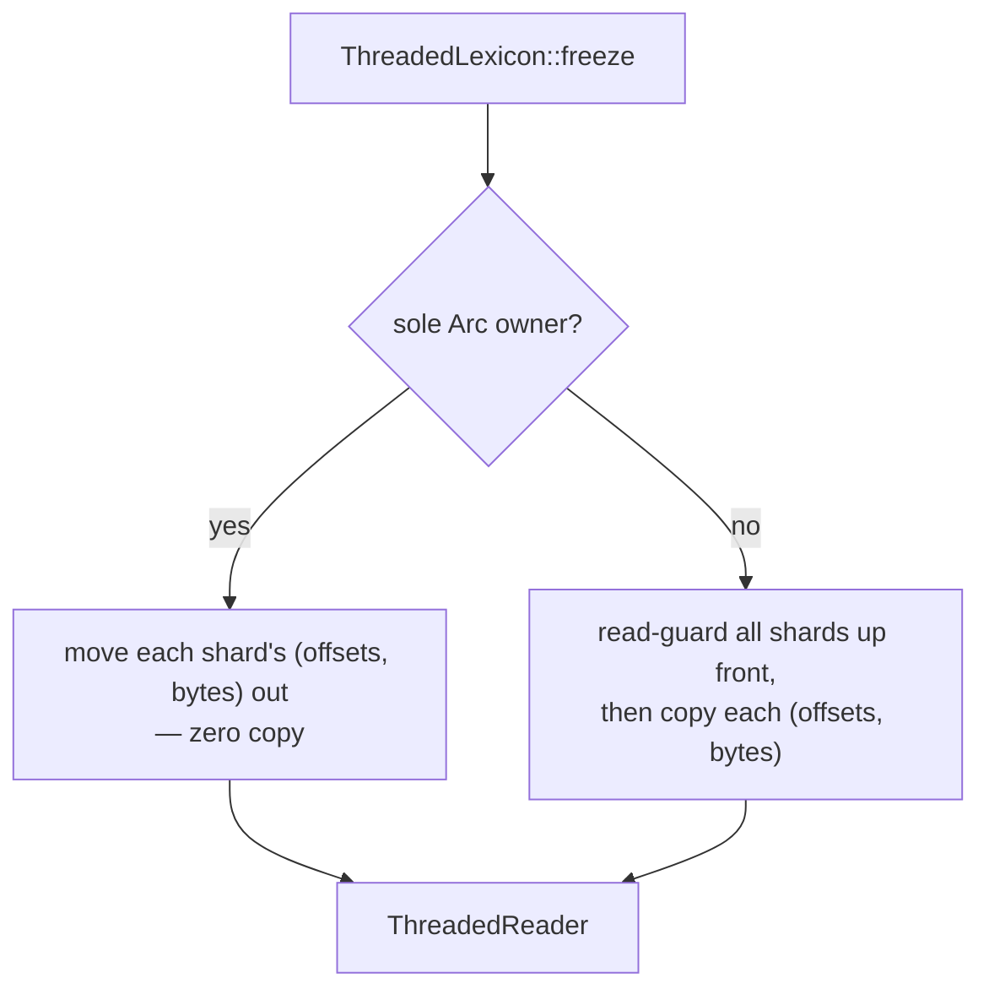

# internity Internal Design

This document describes the internal architecture of `internity`: the data model,
how strings are stored, how handles are encoded, and how the pieces fit together.
It is a conceptual reference for contributors — for the public API and usage, see
the crate docs and `README.md`.

## Contents

- [Mental model](#mental-model)
- [The `Sym` handle](#the-sym-handle)
- [String storage: the CSR model](#string-storage-the-csr-model)
- [`LocalLexicon` — the flat single-threaded engine](#locallexicon--the-flat-single-threaded-engine)
- [`ThreadedLexicon` — the concurrent sharded engine](#threadedlexicon--the-concurrent-sharded-engine)
- [Freezing](#freezing)
- [The `Reader` trait](#the-reader-trait)
- [Dense numbering: `index_of` / `sym_at`](#dense-numbering-index_of--sym_at)
- [`Sym`-keyed maps: `SymMap` / `SymSet`](#sym-keyed-maps-symmap--symset)
- [Serialization (`serde` feature)](#serialization-serde-feature)
- [Capacity and limits](#capacity-and-limits)
- [Testing and verification](#testing-and-verification)
- [Risk areas and novel aspects](#risk-areas-and-novel-aspects)
- [Module map](#module-map)

## Mental model

`internity` is built around a **fill → freeze → read** lifecycle. The two phases
have very different needs, and the design keeps them separate:

- **Fill (interning).** A *lexicon* accepts strings, removes duplicates, and hands
  back a compact handle. This phase mutates state and, for the concurrent engine,
  synchronizes writers. Repeated interning of the same string is collapsed to one
  stored copy.
- **Freeze.** The lexicon is consumed and turned into an immutable *reader*.
  Existing handles stay valid across the boundary.
- **Read (resolving).** A reader maps handles back to strings. It is immutable,
  `Send + Sync`, lock-free, and atomic-free.

Both engines are exposed through a common `Lexicon` trait for generic/dynamic
use, and both freeze into something that implements the sealed `Reader` trait.

## The `Sym` handle

Interning yields a `Sym`: a 4-byte, `Copy` handle. Internally it is a
`NonZeroU32`, which gives two properties for free:

- **Niche optimization.** `Option<Sym>` is also 4 bytes.
- **A reserved zero.** The value `0` is never a valid handle. This satisfies the
  `NonZeroU32` niche and lets the crate reject a *zero* raw value cheaply; it is
  **not** a provenance check — a nonzero handle minted by another interner is not
  detected by the reserved zero.

A `Sym` is only meaningful to the interner that produced it. Each engine packs
its own layout into the 32 bits and only decodes its own handles. There are two
distinct encodings:

| Engine | Encoding | Layout |
|---|---|---|
| `LocalLexicon` | **Dense** | A 1-based insertion index across the whole table. |
| `ThreadedLexicon` | **Sharded** | High bits select the shard, low bits are a 1-based per-shard index. |

Storing indices **1-based** guarantees the raw value is non-zero (satisfying the
`NonZeroU32` niche). Decoding subtracts one to recover the physical index. That
offset is why `Sym::as_u32` must not be used as a side-table index; see
[Dense numbering](#dense-numbering-index_of--sym_at) for the supported
conversions.

Resolution always range-checks, so a handle produced by one engine and resolved
on the other can never cause undefined behavior — but the check is a
memory-safety bound, not a provenance check: an in-range foreign value resolves
to whichever string occupies that slot (see
[Risk areas and novel aspects](#risk-areas-and-novel-aspects)).

The shard/local split is fixed at 6 shard bits and 26 local bits, giving 64
shards and up to approximately 67 million distinct strings per shard.

## String storage: the CSR model

Every place strings are stored — both lexicons and every frozen reader — uses the
same **Compressed-Sparse-Row (CSR)** layout:

- **`bytes`** — a single contiguous buffer holding every interned string's bytes,
  concatenated end to end.
- **`offsets`** — a `u32` table of boundaries. `offsets[i]` is the start and
  `offsets[i + 1]` the end of the *i*-th string. A leading `0` sentinel means the
  table always holds `len() + 1` entries.

Resolving string *i* is then just: read two adjacent `offsets` slots and slice
`bytes` between them — no per-index branch, and the length is implicit in the
neighboring offset.

Because every recorded range was produced by appending an actual `&str`, the
spanned bytes are **always valid UTF-8**. This is exploited to skip UTF-8
re-validation on the hot path (and, unlike slicing a `&str`, the char-boundary
checks that `str` range-indexing performs). All such unchecked reconstruction
lives in a single small storage module — the *only* module of the library that
is not `#[forbid(unsafe_code)]` — with two entry points:

- A **hot-path** helper for an index the dedup table just produced (assumed
  in range).
- A **checked** resolve for public paths that must tolerate foreign or stale
  handles, returning `None` when out of range.

Every other module forbids `unsafe`.

### Byte-input interning (`intern_bytes`)

The "stored bytes are always valid UTF-8" invariant is also exploited on the
*input* side. Both engines expose `intern_bytes(&[u8]) -> Result<Sym, Utf8Error>`
alongside `intern(&str)`. Because callers frequently hold raw bytes straight from
a parser or an I/O buffer, `intern_bytes` accepts them directly and validates
UTF-8 itself — but **only on a dedup miss**. On a hit, the probe compares the
input against a stored entry *byte-for-byte*; a match proves the input equals an
already-interned string, which was validated when it was first inserted, so the
`str::from_utf8` check is skipped entirely.

This amortizes UTF-8 validation across duplicate inserts: in the
high-duplication workloads interning targets, each distinct *valid* byte
sequence is validated once (on its first insert) rather than on every
occurrence. Invalid bytes are never stored, so a repeated invalid input stays a
miss and re-validates each time. The output side is unchanged — handles still
resolve to a checked `&str`. In the sharded engine the check runs while the
upgradable read lock is still held, mirroring the `intern` miss path, so the
miss atomically upgrades to insert with no re-probe.

## `LocalLexicon` — the flat single-threaded engine

`LocalLexicon` is the fastest engine and the simplest. It holds:

- A **dedup hash table** mapping a string's hash to its `Sym`.
- The shared **CSR storage** (`offsets` + a `String` buffer).
- A `BuildHasher` (default is a fast, non-cryptographic Fx hasher).

Interning does a single hash-table probe. On a **hit** (the common steady-state
case) it returns the existing handle immediately. Only a genuine **miss** pays
the insert path, and that path does not re-probe for the key: the string's bytes
are appended to the buffer, the new end boundary is pushed onto `offsets`, a
dense `Sym` is packed, and the handle is inserted into the dedup table as a known
unique entry.

Strings are hashed as raw **bytes** rather than through `<str as Hash>`, which
would append a terminator byte and cost an extra hasher round. Nothing else is
ever mixed into the same hash, so no prefix-disambiguation framing is needed —
and hashing bytes is what lets `intern_bytes` share one hash with `intern`.

The dedup table stores only handles, not strings; comparisons and rehashes
resolve the candidate handle back through the CSR storage. This keeps the table
compact.

**Panic safety.** Growing the hash table or appending to the buffer can panic
(e.g. on allocation failure). A rollback guard truncates `offsets` and `bytes`
back to their pre-insert lengths if anything between the append and the
successful table insertion unwinds, so a partially written string never leaks
into the table.

`LocalLexicon` also implements `Reader` directly, so it can resolve during the
fill phase without freezing (handy when interning and lookups interleave). It
still offers `freeze` to shed the dedup table and hasher for the read phase.

## `ThreadedLexicon` — the concurrent sharded engine

`ThreadedLexicon` allows many threads to intern concurrently. It is a cheap,
cloneable `Arc` handle around shared inner state; cloning just bumps the `Arc`,
so clones can be handed to threads without extra wrapping.

The inner state holds a fixed **inline array of 64 shards** plus the hasher.
Because the `Arc` already heap-allocates the whole struct, the shard array lives
inline — reaching a shard is a single index into the `Arc` payload, no extra
indirection.

### Shard selection

The shard index comes from a **multiply-mix** of the hash (a golden-ratio
constant), taking the top 6 bits. Mixing keeps the shard selector independent of
the lower hash bits that `hashbrown` consumes internally for its control byte and
bucket index, keeping both well distributed.

### Per-shard concurrency

Each shard is its own interning state (a dedup table + CSR storage, identical in
shape to `LocalLexicon`'s) behind a `RwLock`. Each shard is `repr(align(128))`,
placing its lock in its own 128-byte region so neighboring locks do not falsely
share a cache line on architectures with lines up to that size.

Interning uses an **upgradable-read fast path**:

- A dedup **hit** resolves under an upgradable-read lock. That guard coexists
  with other threads' plain `read()` locks (used by `get`), but `parking_lot`
  permits only **one** upgradable guard per lock at a time, so two `intern`
  calls on the *same* shard serialize against each other even when both are
  dedup hits.
- A **miss** atomically upgrades that same guard to the exclusive write lock.
  Because the guard was held throughout, no other writer could have inserted the
  same string in between, so two threads racing on a new string can never mint
  two handles, and the insert skips re-probing.

`intern` calls on *different* shards proceed fully independently; same-shard
`intern` calls (hit or miss) serialize. Sharding therefore parallelizes
interning across shards, not within a single shard. Each shard uses the same
rollback-guard panic-safety scheme as the local engine. Since the engine is
fill-then-freeze, the per-shard
buffer may reallocate freely during the fill phase — no references into it are
outstanding until freeze.

## Freezing

`freeze` consumes an engine and produces an immutable reader. The key property is
that the CSR blobs are handed over as-is, so **no strings are re-walked or
re-validated**, and existing handles keep working.

- **`LocalLexicon::freeze`** moves its `offsets` and buffer into a **`LocalReader`**
  — one dense-indexed CSR blob, no shards, no atomics.
- **`ThreadedLexicon::freeze`** produces a **`ThreadedReader`** — one flat
  per-shard CSR blob, addressed by the handle's `[shard | local]` split.

The concurrent freeze has two paths depending on whether the caller holds the
last `Arc`:

The snapshot path acquires read guards on **all** shards up front, before any
blob is copied. While every guard is held no concurrent `intern` can commit (a
miss cannot upgrade to the write lock while a reader is present), so the copied
state is a single **point-in-time snapshot** even when other clones are still
interning. Guards are taken in shard-index order and `intern` only ever locks
one shard, so this cannot deadlock. Insertions that commit after the guards are
released are naturally not reflected — quiesce all writers before freezing when
the reader must contain every such insertion.

## The `Reader` trait

`Reader` is the read-only, `Send + Sync` view. It is **sealed** (it extends a
private supertrait), so it cannot be implemented downstream — which lets the
crate add methods without a breaking change. Its core operations are
`try_resolve` / `resolve`, `len`, `is_empty`, and `iter` (yielding
`(Sym, &str)` pairs).

Resolution is a pure CSR lookup with a range check, so it needs no locks or
atomics. `LocalReader` resolves a dense index directly; `ThreadedReader` first
indexes the shard (always in range, since the shard bits can't exceed the shard
count) then does a checked local lookup within that shard — decoding the 1-based
local index with a checked subtraction, because a foreign or crafted handle may
have all-zero low bits even though the handle as a whole is non-zero. Iteration
order is handle order for `LocalReader` and shard-grouped for `ThreadedReader`.

Both engines are also reachable through the `Lexicon` trait, which is
dyn-compatible so an engine can be stored as a `Box<dyn Lexicon>`. Its `intern`
takes `&mut self` so a single signature covers both engines; filling a
`ThreadedLexicon` concurrently therefore goes through its inherent
`intern(&self)`, not the trait.

## Dense numbering: `index_of` / `sym_at`

`LocalLexicon` assigns positions consecutively in insertion order, so at any
point the live handles occupy exactly `0..len`. `index_of` maps a handle to its
position and `sym_at` maps back; both are exposed on `LocalLexicon` and, because
`freeze` preserves the numbering, on `LocalReader`.

This lets callers key per-symbol data by a `Vec<T>` index rather than a hash map,
which is the point of the pair — it replaces a downstream `as_u32() - 1`
workaround that depended on the encoding by accident. Note that the raw handle is
1-based (the `NonZeroU32` niche), so `as_u32` is *not* a position; the two
accessors are the supported conversions.

Both types delegate to `dense_index_of` / `dense_sym_at` in `sym.rs`. The mapping
is correctness-critical and must stay identical across the live and frozen forms,
so it has one definition rather than a copy per type.

`ThreadedLexicon` is deliberately excluded. Its handles pack a shard index into
the high bits, so live values are scattered across the handle space and no dense
position exists to return.

### What the guarantee costs

Density is a strong commitment, and stating it publicly forecloses several
options that would otherwise remain open:

- **Removal or tombstoning** of individual entries, which would leave holes.
- **Compaction or GC** of unreferenced strings, which would renumber survivors.
- **Dedup-merging two lexicons**, since both number from zero.
- **Making `LocalLexicon` internally sharded** for larger capacity — precisely
  what costs `ThreadedLexicon` its density.

Once callers persist `Vec<T>` side tables keyed by position, changing any of
these becomes a silent breaking change behind an unchanged signature. This cost
was accepted knowingly: a hedged guarantee would not support the side tables the
API exists to enable. Any future work in the list above needs a new type or a
major version, not a quiet relaxation.

### Frozen string lookup: considered and declined

`freeze` drops the dedup hash map, which is where most of the memory saving comes
from, so a frozen reader resolves handles but cannot look strings up. A helper to
rebuild that lookup (`build_string_index()` or a `FrozenLookup` type) was
considered and declined: it needs no primitives the crate does not already
expose, since `iter` plus `resolve` are sufficient, and binary search over
indirectly-stored strings costs `O(log n)` dependent loads per lookup, which may
well lose to simply keeping the lexicon live. Adding permanent public API to save
callers roughly 18 lines was not a good trade at this stage. The pattern ships as
a worked example on `LocalLexicon::freeze` instead; revisit if field reports show
it is both common and being got wrong.

## `Sym`-keyed maps: `SymMap` / `SymSet`

A `Sym` is already a unique small integer, so hashing it with a general-purpose
hasher is wasted work. `SymHasher` turns the handle straight into a
well-distributed 64-bit hash with a **single multiply** (the same golden-ratio
constant), giving near-perfect, collision-free behavior. `SymBuildHasher` is the
`BuildHasher`, and `SymMap` / `SymSet` are ready-made aliases (with the `std`
feature); in `no_std`, pair `SymBuildHasher` with any hash map.

The hasher accumulates rather than overwrites, so composite keys mix correctly,
while still collapsing to a plain multiply for the single-`u32` `Sym` case.

## Serialization (`serde` feature)

Serialization is **string-based and interner-aware**, so serialized data is
portable across processes and never leaks a lexicon-local handle onto the wire:

- A **`Sym`** has no plain `Serialize`/`Deserialize`. A bare `u32` handle is
  meaningless without the interner that produced it (and comparing handles across
  lexicons is unsound), so instead a `Sym` is (de)serialized *against* a reader or
  interner: it serializes to **its string** and deserializes **from a string**
  back into a freshly interned `Sym`.
- `#[derive(SerializeIn)]` / `#[derive(DeserializeIn)]` extend that model to
  aggregates. `SerializeIn<R: Reader + ?Sized>` resolves every embedded `Sym`
  against a `Reader` (`SerializeInWith::new(value, reader)` adapts a value into a
  plain `serde::Serialize`); `DeserializeIn<'de, I: Lexicon + ?Sized>` re-interns
  every string into the target interner (`interner.deserialize_in(deserializer)`).
  Both sides are `?Sized`, so erased contexts work symmetrically — a `&dyn Reader`
  on the serialize side and a `&mut dyn Lexicon` on the deserialize side.
- Impls cover `Sym`, scalars/`String`, `Option`, `Box`, `Vec`, `BTreeMap`,
  `BTreeSet`, tuples (arities 1–16, matching Serde), and — under `std` — `HashMap`
  / `HashSet` (including the
  `SymMap` / `SymSet` aliases). `#[internity(via_serde)]` opts a field out to its
  ordinary `serde` impl. `serde`'s `skip_serializing_if` is rejected at
  compile time by `SerializeIn` (a runtime skip predicate would diverge from the
  type's ordinary wire schema); use `skip_serializing` to always omit a field.
- A whole corpus serializes via **`SerializeReader`**: freeze a lexicon into a
  `Reader`, then wrap it — it emits the **sequence of interned strings** in handle
  order. The live `ThreadedLexicon` is **deserialize-only** (re-interning a string
  sequence into a fresh engine); serialize its frozen `Reader` instead, which
  takes a single point-in-time snapshot rather than tearing across shards under a
  concurrent writer. Re-interning that sequence reproduces *identical* handles
  only for the **default hasher**: dense handles follow insertion order, and
  sharded handles additionally depend on how the hasher assigns shards, so
  deserialization into a `ThreadedLexicon` is restricted to the default hasher.

## Capacity and limits

- The `u32` offset table caps a single flat buffer (`LocalLexicon`, or one shard)
  at approximately 4 GiB of string bytes; a `ThreadedLexicon` spreads across 64
  shards for approximately 256 GiB total.
- The 4-byte handle bounds the number of distinct strings: approximately 4.29
  billion for the dense encoding, approximately 67 million per shard for the
  sharded one.
- Exceeding any limit **panics** rather than corrupting data. Applications
  interning untrusted input should enforce count/byte quotas up front and supply
  a DoS-resistant `BuildHasher`.
- Capacity arguments are *hints*: both engines still grow past them. The
  concurrent engine divides a hint evenly across shards, and skips eager
  per-shard preallocation entirely below an average of 8 strings per shard
  (approximately 512 strings), where sizing all 64 shards would waste memory on
  the many that stay empty.

## Testing and verification

The design leans on a few invariants that are not visible in the type system —
"every stored byte range is valid UTF-8", "racing threads never mint two handles
for one string", "a `Sym` never means something to a foreign lexicon" — so the
verification strategy is organized around those invariants rather than around
code coverage.

**Behavioral tests.** The integration tests drive the public API only, which
keeps them honest about what the design actually promises: dedup identity,
handle stability across `freeze`, iteration order, the `Lexicon`/`Reader` trait
views (including `dyn` dispatch), `SymMap`/`SymSet`, and the byte-input path
(including a forced hash collision, so the byte-wise comparison in the probe is
load-bearing rather than incidentally correct). Two of them arm a hasher that
panics mid-rehash and then assert the lexicon is still consistent — that is the
direct test of the rollback guard described under
[`LocalLexicon`](#locallexicon--the-flat-single-threaded-engine), for both
engines. Another spawns a writer against a concurrent `freeze` and asserts the
snapshot is a consistent prefix.

**Property tests (`bolero`, run by `just bolero`).** Two properties matter most
and neither is easy to reach with hand-written cases. The first feeds arbitrary
byte-derived words through both engines and checks dedup, resolution, `len`, and
`iter` against a `HashMap` oracle across the freeze boundary. The second is the
important one for safety: it reconstructs `Sym`s from **arbitrary raw `u32`s**
and asserts every one is either rejected or resolves to exactly the string the
oracle predicts. That is the fuzzed statement of "the unchecked storage path can
never be reached with an out-of-range index".

**Model checks (`loom`, `just loom`) — and their precise scope.** The loom
target is a `[[test]]` gated on the `loom` feature and compiled under
`--cfg loom`. It deliberately models an *algorithm sketch*, not the production
types: loom cannot instrument `parking_lot`, and `loom::sync::RwLock` has no
upgradable-guard primitive, so the production transition — hold one upgradable
guard, atomically upgrade it on a miss — is inexpressible in the model. The
sketch instead uses the textbook `std`-style read, drop, write, re-check
sequence, which needs the re-check precisely because it has the read-drop gap
that the production path does not.

What the models therefore prove is the *abstract* interning contract under
exhaustive interleaving: racing equal strings collapse to a single handle,
racing distinct strings all stay resolvable and distinct, and a concurrent
snapshot observes a consistent prefix. What they do **not** prove is that the
production upgradable-read implementation is correct — that rests on
`parking_lot`'s documented guard semantics plus the behavioral and property
tests above. Reading the loom results as model-checking the shipped lock would
be a mistake, which is why the target is named for sketches.

**Compile-fail tests (`trybuild`).** Three of the design's guarantees are
*negative* — they are about what deliberately does **not** compile — and a
negative guarantee silently evaporates unless a test pins it. Each fixture locks
in a rule argued in [Serialization](#serialization-serde-feature):

| Fixture | Guarantee it pins |
|---|---|
| `sym_is_not_serde.rs` | A bare `Sym` implements neither `Serialize` nor `Deserialize`, so a handle can never reach the wire without its interner. |
| `serialize_in_rejects_skip_serializing_if.rs` | `SerializeIn` rejects `skip_serializing_if` through the real proc-macro entry point, on both named and tuple fields, keeping the derive's wire schema identical to the type's ordinary one. |
| `threaded_lexicon_is_not_serialize.rs` | A live `ThreadedLexicon` is not `Serialize`, forcing callers through `freeze` and making the snapshot boundary explicit. |

**Derive parity and derive regressions.** `serde_attr_parity.rs` pins the
property that makes the derives usable at all: for each supported field-schema
attribute (`rename`/`rename_all`, `alias`, `skip`/`default`, container
`default`, `deny_unknown_fields`, `transparent`, `deserialize_with`) it pairs an
interned struct of `Sym` fields against a plain `serde` struct of `String`
fields carrying the *same* attributes, and asserts both accept and reject the
same JSON and agree on the decoded strings. In other words, `DeserializeIn` is
required to be schema-identical to `Deserialize` — swapping `String` for `Sym`
must not move the wire format. `derive_regressions.rs` covers hygiene hazards in
the expansion: a struct named like the generated interner parameter, a field
literally named `__interner`, raw identifiers, and a user function colliding
with a generated helper name.

**Workspace-wide verification.** CI runs Miri (base, plus `-Zmiri-tree-borrows`,
`-Zmiri-strict-provenance`, and a rotating `-Zmiri-many-seeds` window),
`cargo careful`, `cargo mutants` (diff-scoped on pull requests, full runs
nightly), and coverage. Because the library has exactly one module with
`unsafe`, Miri's job here is narrow and precise: it validates the unchecked
UTF-8 reconstruction and the index arithmetic that feeds it — that
`get_unchecked` on `offsets`/`bytes` is always in bounds and that
`from_utf8_unchecked` never sees non-UTF-8 — on every path the test suite
reaches. Mutation testing complements that by catching invariants that are
asserted nowhere: a mutant that weakens a bound check or drops the rollback
guard must make some test fail.

**Benchmarks.** The crate benchmarks head-to-head against `lasso`,
`string-interner`, `symbol_table`, `ustr` and `string_cache` on the same corpus,
in three flavors: Criterion wall-clock benches, Callgrind/gungraun
instruction-count benches (paired with the Criterion ones so a regression can be
attributed to instructions rather than noise), and a heap-footprint bench that
measures live bytes through a tracking global allocator — the memory dimension
matters here because the CSR layout trades a bump-arena's stable references for
density. [`PERF.md`](PERF.md) publishes a curated wall-clock-only subset plus the
memory footprint; [`COMPARISON.md`](COMPARISON.md) sets the design against the
rest of the ecosystem.

## Risk areas and novel aspects

### What is unusual about this design

- **Handles survive a phase change.** The fill → freeze → read lifecycle is not
  just an optimization: a `Sym` minted during fill remains valid, unchanged,
  against the frozen reader. That is what lets the read phase drop the dedup
  table, the hasher, and all locks without invalidating anything a caller
  already holds.
- **Freeze is a hand-off, not a rebuild.** Because both phases already store
  strings in the same CSR shape, freezing moves the `(offsets, bytes)` blobs and
  re-walks nothing — no re-validation, no re-hashing, no pointer patching. The
  frozen form costs one allocation pair per blob and resolves branch-free.
- **Two encodings behind one handle type.** `Sym` is a single public type with
  two private layouts. Callers never choose an encoding, and neither engine
  decodes handles minted by the other; the cost is that the type carries no
  marker saying which engine minted it (see below).
- **UTF-8 validation amortized across duplicates.** `intern_bytes` turns the
  storage invariant into an *input*-side optimization: a dedup hit proves the
  input equals an already-validated string, so validation is skipped. Interning
  workloads are duplicate-heavy by definition, which is exactly when this pays.
- **A dedup miss becomes an insert without re-probing.** The upgradable-read
  guard is held continuously across the miss, so no other writer can slip in;
  the insert is a known-unique insert. This removes both the re-probe and the
  possibility of two handles for one string.
- **Serde that refuses the obvious thing.** A `Sym` has no plain `Serialize`
  precisely *because* the obvious implementation would be a silent correctness
  trap across processes.
- **A hasher that is one multiply.** `SymHasher` exploits the fact that a `Sym`
  is already a dense unique integer.

### Where the design is fragile

- **The unchecked UTF-8 reconstruction rests on an append-time invariant.** The
  storage module's soundness comes entirely from "every byte range recorded in
  `offsets` was produced by appending a `&str`". Any future code path that
  appends bytes not *proven* to be UTF-8 — for example an `intern_bytes` variant
  that stored the bytes before validating, or a bulk-load path that adopted a
  caller-supplied buffer — makes `from_utf8_unchecked` unsound while touching no
  `unsafe` block itself. What enforces it today: appends happen in exactly two
  places (`LocalLexicon::insert_new` and `ShardWrite::insert_new`), both take
  `&str`, and `intern_bytes` validates *before* calling them.
- **Two entry points with different contracts.** The hot-path helper assumes an
  in-range index and must only be called with an index the storage's own dedup
  table (or its own `0..len` iteration) produced; the checked resolve is what
  every public `try_resolve` path uses. Routing a caller-supplied handle to the
  hot-path helper would be immediate undefined behavior. This is the crate's
  single sharpest edge and the reason the two helpers live side by side in one
  small module with the contract stated on each.
- **Cross-lexicon handle confusion is a real correctness trap.** Resolving a
  `Sym` against a lexicon that did not mint it is memory-safe — it is
  range-checked — but it is *not* detected. When the raw value happens to be in
  range, it silently resolves to an unrelated string, and no error is reported.
  The reserved zero is a niche, not a provenance tag, and `Sym::from_u32` checks
  only that niche. Nothing in the type system prevents this. Callers holding
  several lexicons must keep handles and their owning lexicon associated by
  construction; the design deliberately buys a 4-byte handle at the price of
  provenance checking.
- **Panic safety depends on the rollback guard.** Between appending a string's
  bytes and inserting its handle, the CSR state is momentarily "one string
  ahead" of the dedup table, and the table insert can unwind (growth, rehash, or
  a user `BuildHasher` that panics). Without the guard, an unwind would leave a
  partially written string recorded in `offsets`, so a later index would span
  the wrong bytes and `len` would over-count — a silently corrupt lexicon that
  is still perfectly memory-safe, hence hard to notice. The guard truncates both
  `offsets` and `bytes` back to their pre-insert lengths and is defused with
  `mem::forget` only after the table insert has succeeded.
- **Freeze snapshots have an explicit horizon.** The shared freeze path holds a
  read guard on *every* shard before copying any of them, so the result is one
  point-in-time snapshot rather than a per-shard-torn one. Two consequences
  follow directly: insertions that commit after the guards are released are
  silently absent (quiesce writers first if the reader must be complete), and
  the no-deadlock argument rests on guards being taken in shard-index order
  while `intern` only ever locks one shard. Any future operation that locks two
  shards at once must respect that same order.
- **Untrusted input is a DoS surface.** The default hasher is fast and
  non-cryptographic, so an adversary who controls interned strings can force
  hash collisions and degrade probes, and — because nothing is ever reclaimed —
  can grow storage until a [capacity limit](#capacity-and-limits) panics. The
  mitigations are external to the data structure: apply count and byte quotas
  before interning, and supply a DoS-resistant `BuildHasher`.
- **Skewed keys serialize interning.** Sharding parallelizes across shards, not
  within one: `parking_lot` allows a single upgradable-read guard per lock, so
  two `intern` calls landing on the same shard serialize even when both are
  dedup hits. A workload whose strings concentrate in a few shards therefore
  degrades toward serialized interning. The multiply-mix shard selector keeps
  the distribution good for well-distributed hashes, but it cannot rescue a
  hasher that clusters. For read-heavy phases, `freeze` — not repeated `intern`
  calls — is the answer.
- **Everything is `u32`-bounded, and the bound is checked at insert time.** The
  end offset is computed with a `checked_add` plus a `u32::try_from`, and the
  sharded engine additionally asserts the local index stays below the 26-bit
  mask, so an overflow panics instead of wrapping into an offset that would
  alias another string's bytes. Those checks are the only thing standing between
  a very large corpus and a corrupt `offsets` table; they must not be relaxed
  into unchecked arithmetic on the grounds that the hot path is slow.

### Known limitations

- Approximately 4 GiB of string bytes per flat buffer (one `LocalLexicon`, or
  one shard) and a per-shard ceiling of approximately 67 million distinct
  strings.
- No removal, reclamation, or garbage collection: interned strings live until
  the lexicon or reader is dropped.
- No handle provenance checking, by design (see above).
- No resolution during concurrent fill: `ThreadedLexicon` is fill-then-freeze,
  and `get` answers "is this interned?" rather than "what does this handle
  mean?".

## Module map

A quick orientation to how the concepts map onto the source layout:

| Area | Concept |
|---|---|
| Handle | `Sym` encoding (dense + sharded), niche, packing/decoding |
| Storage | CSR helpers; the crate's single `unsafe` module |
| Local engine | `LocalLexicon` + its `LocalReader` |
| Concurrent engine | `ThreadedLexicon`, its inner state, `Shard`, `ShardWrite`, and `ShardReader` / `ThreadedReader` |
| Traits | `Lexicon` (fill, generic/dyn) and `Reader` (read, sealed) |
| Maps | `SymHasher` / `SymBuildHasher` and the `SymMap` / `SymSet` aliases |
| Serde | string-based, interner-aware (de)serialization (`SerializeIn` / `DeserializeIn` / `SerializeReader`) |
