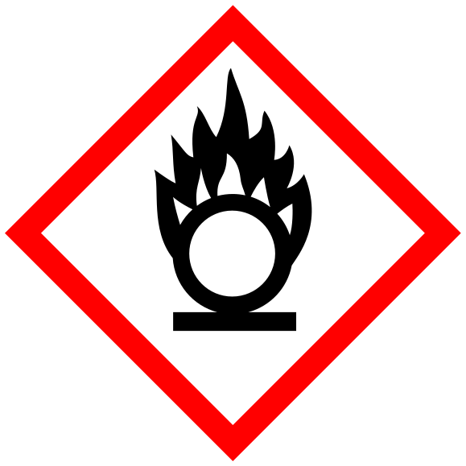

 

# Templated Uri Macros

Macros for the [`templated_uri`][__link0] crate.

This crate was developed as part of <a href="../..">The Oxidizer Project</a>. Browse this crate's <a href="https://github.com/microsoft/oxidizer/tree/main/crates/templated_uri_macros">source code</a>.

 [__link0]: https://docs.rs/templated_uri
